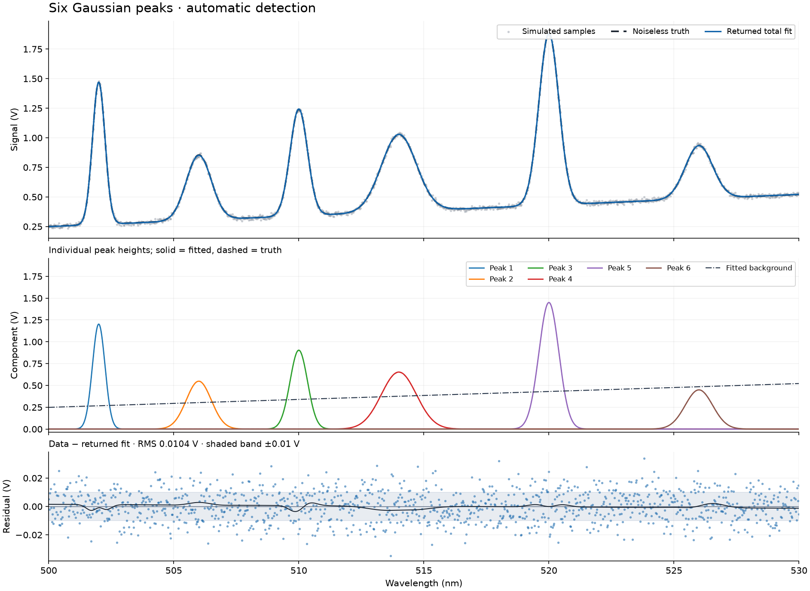
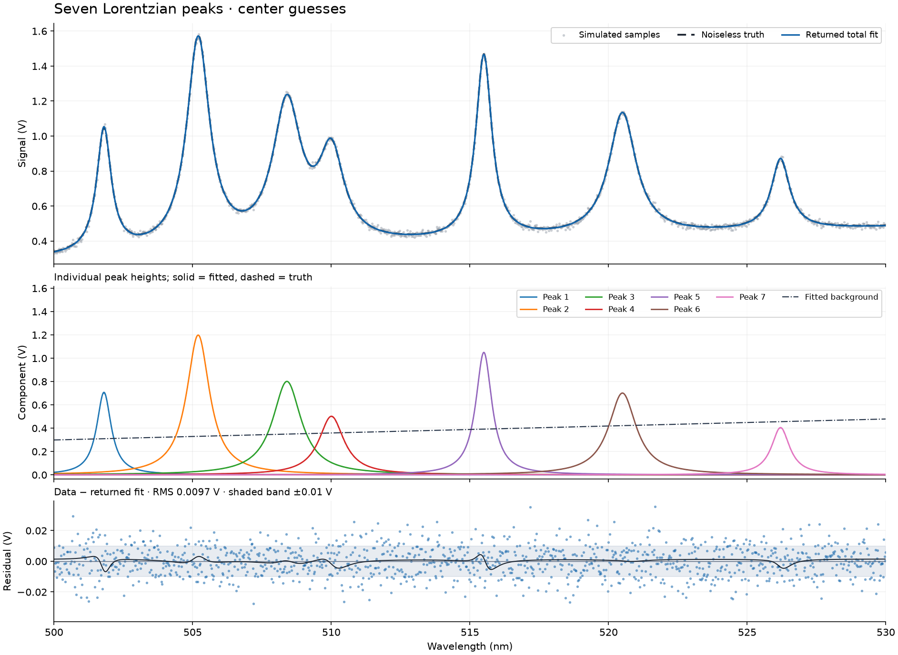
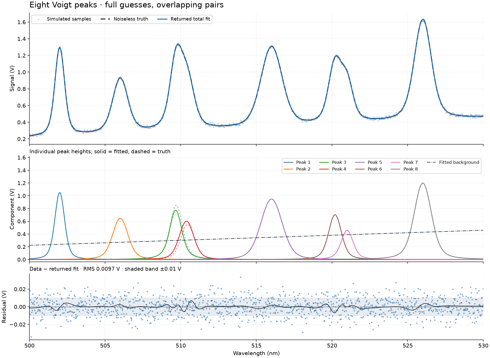

# More peaks and partial overlap

These are three synthetic voltage spectra fitted through the public `spectrum_fit` function. They extend the [single-peak examples](README.md). Each spectrum uses one profile family, a linear background, and the default Levenberg–Marquardt optimizer. These plots are human gut checks, not acceptance tests.

## What is simulated

Wavelengths span 500–530 nm, sampled every 0.025 nm (1,201 point samples). Component peak heights range from 0.40 to 1.45 V. Widths and heights vary within each spectrum. The linear background starts at 0.22–0.30 V and has a slope of 0.006–0.009 V/nm. Independent additive Gaussian read noise has standard deviation 0.01 V. These are generic simulated detector signals; they do not describe a particular instrument or chemical species.

| Example | Components | Starting information | Residual RMS (V) |
|---|---:|---|---:|
| gauss | 6 | Automatic detection; prominence 0.12 V, distance 40 samples (1 nm) | 0.010417 |
| lorentz | 7 | Seven centers, displaced by 0.08–0.12 nm; heights/widths estimated by the fitter | 0.009723 |
| voigt | 8 | Eight full rows; centers displaced by 0.08–0.10 nm, heights/widths perturbed by 10–15% | 0.009654 |

RMS means root mean square. All three calls returned without warnings and preserved the input arrays. Each fit returned the illustrated component count. The starting guesses in the last two cases are deliberately close to the generating parameters, so these examples show local fitting with informed guesses; they do not establish a large basin of convergence.

## How to read the plots

The top panel shows grey noisy samples, black dashed noiseless truth, and the blue returned total fit. The middle panel shows individual components: solid colored curves are fitted components; dashed curves in the same colors are generating components. The dark dash-dot line is the fitted background. Components are drawn above zero, without adding the background to each one. The bottom panel shows blue data-minus-fit residuals and the black noiseless-truth-minus-fit curve. The shaded ±0.01 V band is a noise-scale guide, not a confidence band.

Amplitude is the height of an individual component in V, not its area or the total signal at its center. Gaussian sigma is its standard deviation; Lorentzian gamma is its half width at half maximum. Voigt uses both, in nm.

Automatic detection looks for local maxima. Overlapping components may not create separate maxima. The Voigt spectrum contains eight generating components but only six broad visible features; the eight-component fit is supplied with all eight initial parameter rows. A small total residual does not by itself establish a unique or accurate decomposition. Compare the solid and dashed individual components, especially near 510 nm.

## Detailed plots and parameters

Parameter entries below are **generating truth → returned fit**, sorted by fitted center. They describe these recorded examples; they are not acceptance tolerances or confidence intervals.

### Six Gaussian peaks: automatic detection

| Peak | Height (V) | Center (nm) | Sigma (nm) |
| --- | --- | --- | --- |
| 1 | 1.2000 → 1.2023 | 502.0000 → 501.9999 | 0.2500 → 0.2508 |
| 2 | 0.5500 → 0.5481 | 506.0000 → 505.9999 | 0.5000 → 0.5005 |
| 3 | 0.9000 → 0.9035 | 510.0000 → 509.9987 | 0.3500 → 0.3493 |
| 4 | 0.6500 → 0.6528 | 514.0000 → 513.9997 | 0.7000 → 0.7017 |
| 5 | 1.4500 → 1.4497 | 520.0000 → 520.0000 | 0.4000 → 0.3994 |
| 6 | 0.4500 → 0.4488 | 526.0000 → 525.9970 | 0.5500 → 0.5484 |

Background at 500 nm: 0.2500 → 0.2485 V. Slope: 0.00900 → 0.00909 V/nm.

### Seven Lorentzian peaks: center guesses

| Peak | Height (V) | Center (nm) | Gamma (nm) |
| --- | --- | --- | --- |
| 1 | 0.7000 → 0.7071 | 501.8000 → 501.8018 | 0.3200 → 0.3169 |
| 2 | 1.2000 → 1.1979 | 505.2000 → 505.1997 | 0.5000 → 0.5022 |
| 3 | 0.8000 → 0.8009 | 508.4000 → 508.4005 | 0.6200 → 0.6230 |
| 4 | 0.5000 → 0.5019 | 510.0000 → 510.0055 | 0.5500 → 0.5505 |
| 5 | 1.0500 → 1.0493 | 515.5000 → 515.5022 | 0.3500 → 0.3521 |
| 6 | 0.7000 → 0.7011 | 520.5000 → 520.5005 | 0.6000 → 0.6006 |
| 7 | 0.4000 → 0.4053 | 526.2000 → 526.2025 | 0.4000 → 0.3996 |

Background at 500 nm: 0.3000 → 0.2987 V. Slope: 0.00600 → 0.00599 V/nm.

### Eight Voigt peaks: overlapping pairs with full guesses

| Peak | Height (V) | Center (nm) | Sigma (nm) | Gamma (nm) |
| --- | --- | --- | --- | --- |
| 1 | 1.0500 → 1.0492 | 502.0000 → 501.9980 | 0.2500 → 0.2530 | 0.1500 → 0.1428 |
| 2 | 0.6500 → 0.6461 | 506.0000 → 506.0011 | 0.4000 → 0.4082 | 0.2200 → 0.2073 |
| 3 | 0.8500 → 0.7710 | 509.7000 → 509.6656 | 0.3000 → 0.2773 | 0.2400 → 0.2538 |
| 4 | 0.5500 → 0.6010 | 510.4500 → 510.3795 | 0.3500 → 0.3975 | 0.2000 → 0.1808 |
| 5 | 0.9500 → 0.9472 | 516.0000 → 515.9988 | 0.6000 → 0.6090 | 0.2200 → 0.2065 |
| 6 | 0.7000 → 0.7016 | 520.2000 → 520.1956 | 0.3500 → 0.3332 | 0.1800 → 0.1937 |
| 7 | 0.4500 → 0.4574 | 521.0000 → 520.9914 | 0.3000 → 0.2921 | 0.2000 → 0.2139 |
| 8 | 1.2000 → 1.1968 | 526.0000 → 525.9981 | 0.4500 → 0.4548 | 0.2500 → 0.2456 |

Background at 500 nm: 0.2200 → 0.2225 V. Slope: 0.00800 → 0.00790 V/nm.

## Data and provenance

Generated using runtime source candidate `576602a6497ce1b893c2adce61c8a0a56136a592` with CPython 3.12.14, NumPy 2.5.3, SciPy 1.18.1 and Matplotlib 3.11.2. Product code and numerical tests are unchanged. The public numerical conventions are documented in the [approved contract](../../tasks/SPECTRUM-FITTING-001-contract.md).

[multi-peak-data.npz](multi-peak-data.npz) stores each example’s wavelengths, samples, generating peaks/background, noise, supplied guesses where applicable, returned parameters, fitted signals, residuals and full covariance in physical units. Keys begin with `gauss_six_`, `lorentz_seven_` or `voigt_eight_`.

[multi-peak-manifest.json](multi-peak-manifest.json) records all generating parameters, fixed random seeds, starting guesses, solver options, returned values, warnings, library versions, runtime hashes and asset SHA-256 hashes. Covariance is a local approximation; these examples make no uncertainty-calibration claim.
