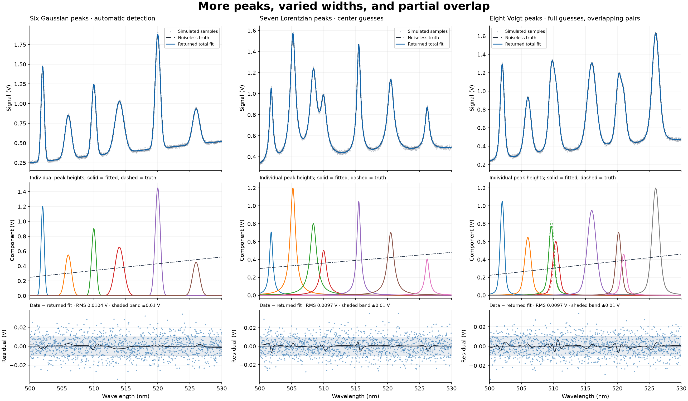
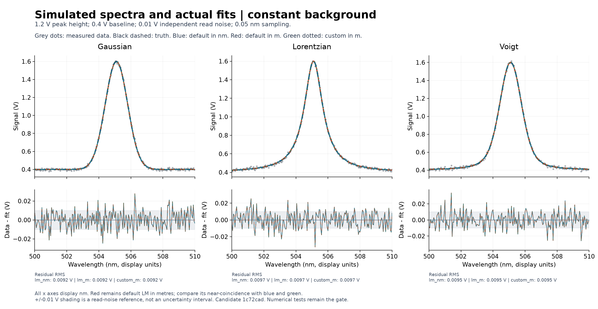
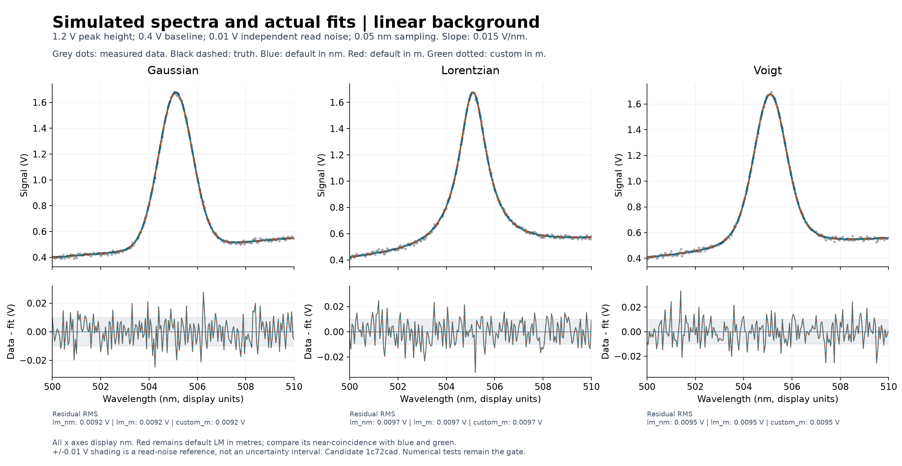
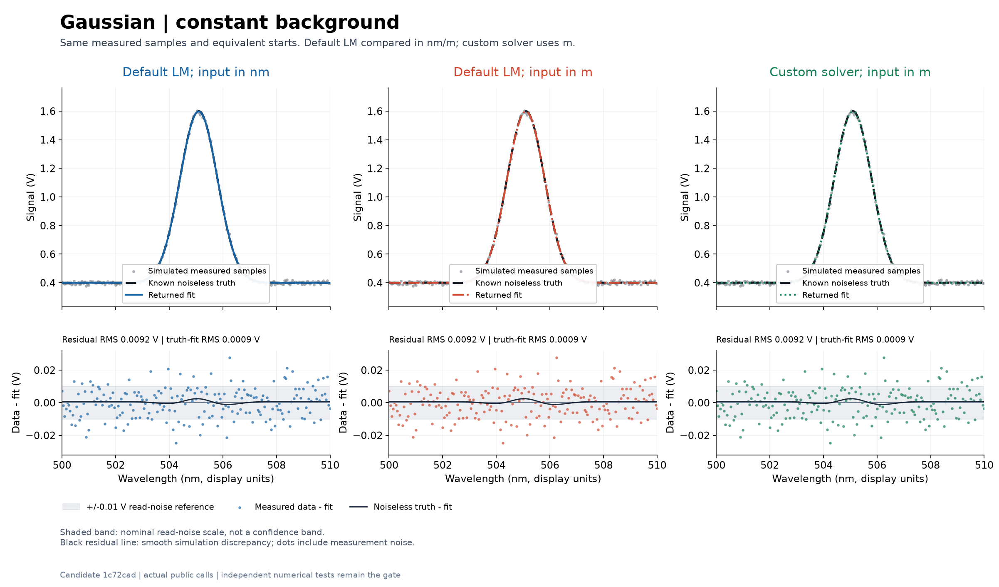
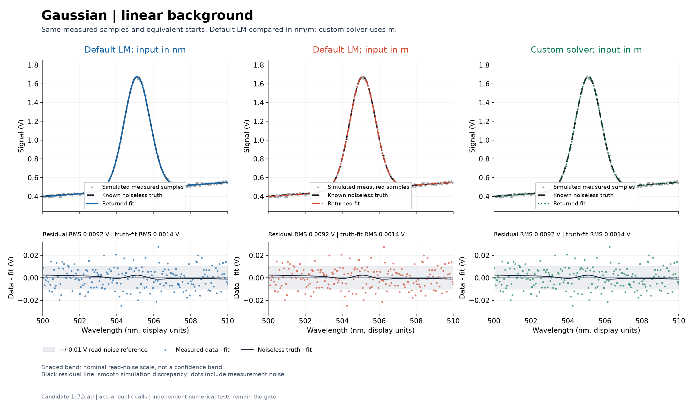
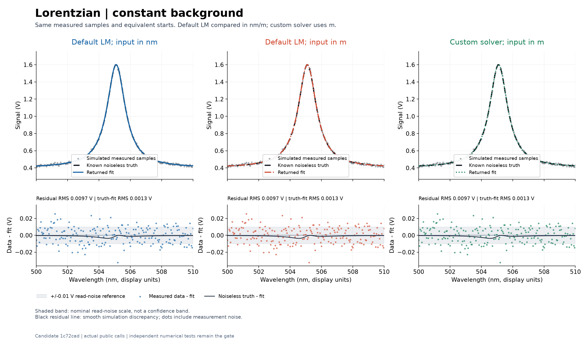
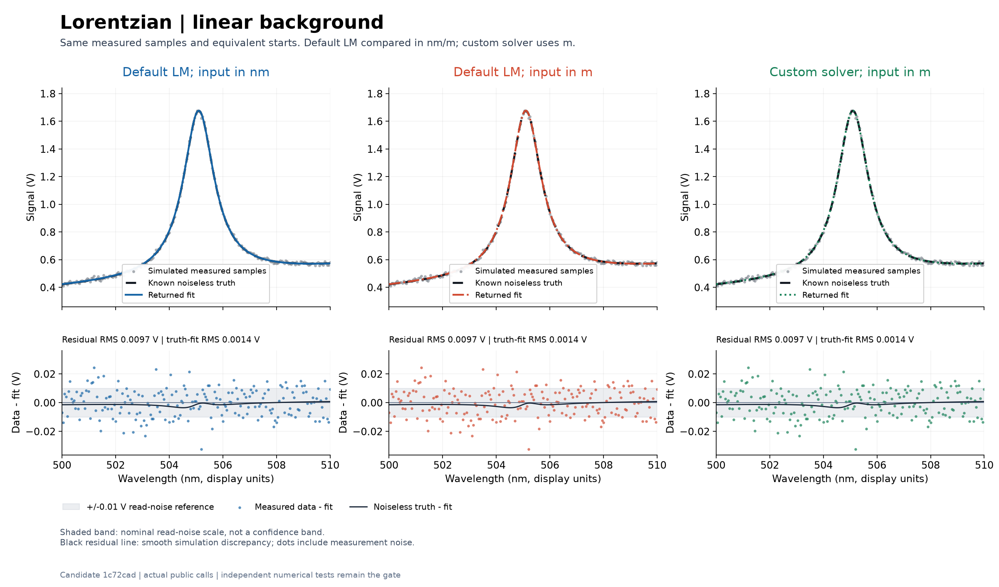
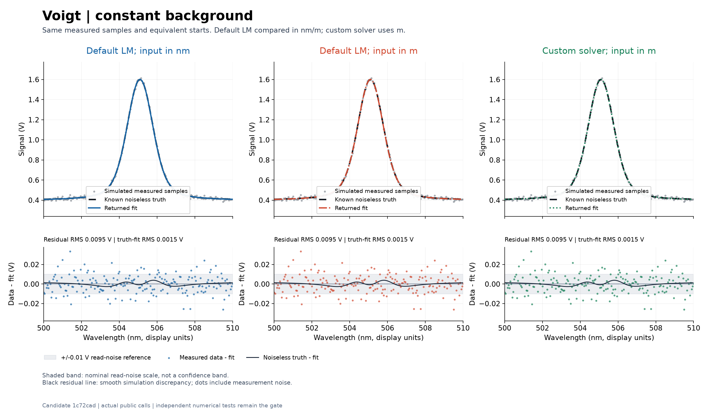
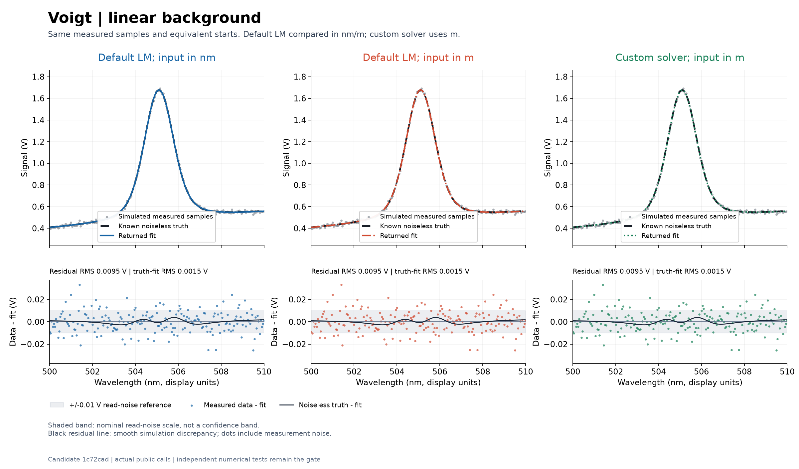

# Spectrum fitting: visual examples

These simulated spectra and returned fits are visual gut checks, not acceptance tests. Open [spectrum-review.html](spectrum-review.html) locally for the eight figures and six parameter tables. The page uses relative asset links and needs no server.

Each single-peak case below contains one positive Gaussian, Lorentzian, or Voigt peak with a constant or linear background. The component peak height is 1.2 V; the background starts at 0.4 V at 500 nm. The linear background adds 0.015 V/nm. Samples span 500–510 nm at 0.05 nm intervals, with independent additive read noise of standard deviation 0.01 V.

The same simulated voltage samples and physically equivalent starting guesses were fitted with wavelength coordinates supplied in nanometres (nm) or metres (m). All plots and parameter tables display wavelengths and widths in nm, signals in V, and slopes in V/nm.

- Grey dots: simulated measured voltage samples.
- Black dashed signal curve: the known noiseless generating model.
- Blue: default Levenberg–Marquardt (LM) fit using nm coordinates.
- Red: default LM fit using m coordinates. It remains plotted where it overlaps the other fits.
- Green dotted: a configured custom solver using m coordinates, with SciPy's Trust Region Reflective method.

Residuals are measured data minus returned fit. The black residual curve is noiseless truth minus returned fit. Shading at ±0.01 V is a read-noise reference, not a confidence band. Gaussian sigma is a standard deviation; Lorentzian gamma is a half width at half maximum; Voigt uses both widths.

## More peaks and partial overlap

[Multi-peak examples](MULTI-PEAK.md) show six Gaussian peaks found automatically, seven Lorentzian peaks fitted from center guesses, and eight Voigt peaks fitted from full parameter guesses. They include varied peak heights/widths, sloping backgrounds, individual fitted and true components, and residuals. The crowded Voigt pairs illustrate why a good total fit alone does not establish an accurate decomposition. Each fit uses the existing default optimizer and nm coordinates.

## Overviews

## Individual comparisons

Gaussian: constant background

Gaussian: linear background

Lorentzian: constant background

Lorentzian: linear background

Voigt: constant background

Voigt: linear background

## Data and provenance

The source runtime product commit is `f3a655709920f6c7f13a392c5c6265ae8d2f045e`. The plots were generated from preparation `1c72cadf8f31a7a5925b06eb7183aa5319e5fb52`, before later tests/docs-only corrections. The preserved image and numerical-data bytes were not regenerated for later candidates.

The recorded runtime was CPython 3.12.14, NumPy 2.5.3, SciPy 1.18.1, and Matplotlib 3.11.2. All 18 recorded public fitting calls returned fits with no numerical warnings. These examples do not establish covariance accuracy or replace the numerical verification gate.

[spectrum-review-data.npz](spectrum-review-data.npz) contains the samples, truth, initial guesses, returned parameters, fitted signals, residuals, and covariance arrays in each call's physical units. [spectrum-review-manifest.json](spectrum-review-manifest.json) records units, provenance, and SHA-256 hashes.
